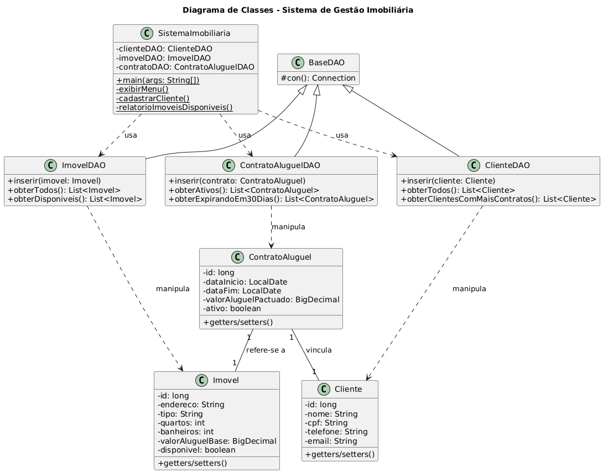
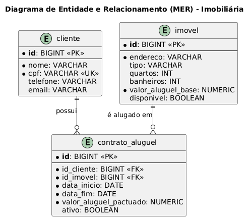

# Sistema de Gestão Imobiliária

Este é um projeto para gerenciar clientes, imóveis e contratos de aluguel de uma imobiliária, desenvolvido em Java com persistência em banco de dados PostgreSQL.

## Diagrama de Classes (UML)

O diagrama abaixo representa a arquitetura do software, mostrando as principais classes e seus relacionamentos.

## Diagrama de Entidade e Relacionamento (MER)

Este diagrama descreve a estrutura do banco de dados, com as tabelas, colunas e chaves primárias/estrangeiras.

